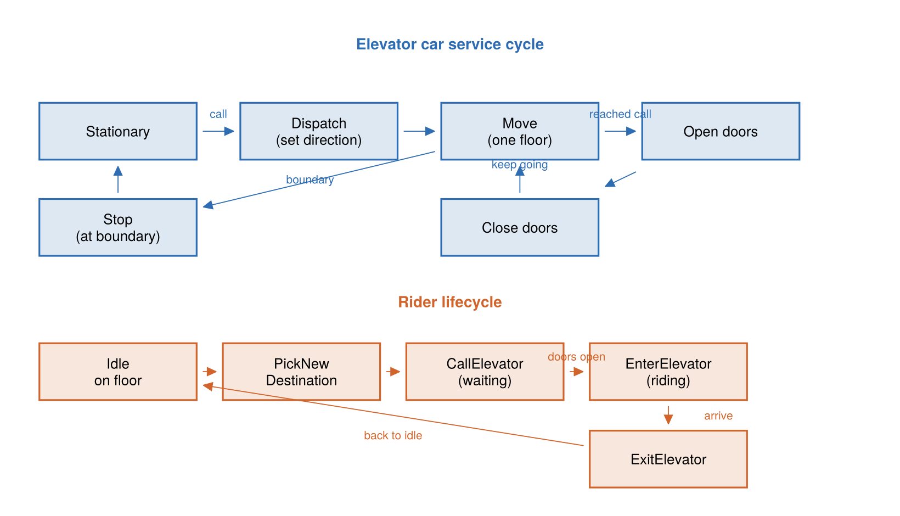

# The Elevator Model

The elevator example is a continuous-time port of a well-known TLA+
specification. It models a building with several elevator cars, a set of people
who travel between floors, and a simple dispatcher that decides which car
answers which call.

## Where it comes from

The model is a Julia/ChronoSim port of the `Elevator` module from the
[tlaplus/Examples](https://github.com/tlaplus/Examples) collection. The header
of [`src/elevator/elevator.jl`](https://github.com/adolgert/ChronoSimExamples.jl/blob/main/src/elevator/elevator.jl)
records the provenance:

```julia
# This implements a set of elevators and people interacting.
# The spec comes from https://github.com/tlaplus/Examples which has
# elevator.tla, the MODULE Elevator.
#
# Run the .tla with `java -jar tla2tools.jar -config Elevator.cfg Elevator.tla`.
```

The original specification is kept in the repository at
`src/elevator/Elevator.tla` as provenance documentation. Its own module comment
describes the design:

> This spec describes a simple multi-car elevator system. The actions in this
> spec are unsurprising and common to all such systems except for
> `DispatchElevator`, which contains the logic to determine which elevator ought
> to service which call. The algorithm used is very simple and does not optimize
> for global throughput or average wait time.

The Julia model mirrors the TLA+ variables, its nine actions, and its type and
safety invariants. The important difference is that the TLA+ spec is *untimed* —
it describes which actions are legal, not when they happen — while the ChronoSim
port draws a waiting time for every action from an `Exponential(1.0)` clock, so
the model becomes a continuous-time stochastic simulation.

!!! note "Two dead files"
    `src/elevator/elevator_tla_example.jl` is a stale demo that references APIs
    the model no longer exposes; it will not run. The TLA+/TLC trace glue was
    also retired to `attic/elevatortla.jl`. Model-checking validation now goes
    through Quint (`test/test_quint.jl`). Do not treat either as a live example.

## What it models

A building with a fixed number of floors, a fixed set of people, and a fixed set
of elevator cars. People decide to travel to another floor, press a hall call,
board a car whose doors open in their direction, ride to their destination, and
leave. Each car moves up or down one floor at a time, opens and closes its doors,
and tracks the destination buttons its passengers have pressed. A dispatcher
assigns the closest stationary or already-approaching car to each active call.

## State

The state is declared with ChronoSim's `ObservedState` macros, so the framework
observes every read a precondition makes and every write a firing makes. There
are four keyed record types and one top-level observed state.

A direction enum carries a content-based hash so that clock keys built from it
reproduce across processes and modules — a detail that matters when the
hand-written and derived twins compare trajectories:

```julia
@enum ElevatorDirection Up Down Stationary
Base.hash(x::ElevatorDirection, h::UInt) = hash(Symbol(x), h)
```

A **`Person`** is keyed by an integer id:

```julia
@keyedby Person Int64 begin
    location::Int64      # floor the person is on; 0 while riding
    destination::Int64   # target floor
    elevator::Int64      # elevator id they are in; 0 if not riding
    waiting::Bool        # waiting for a called elevator
end
```

An **`ElevatorCall`** is keyed by a `(floor, direction)` pair and records whether
that hall call is currently active:

```julia
@keyedby ElevatorCall Tuple{Int64,ElevatorDirection} begin
    requested::Bool
end
```

An **`Elevator`** is keyed by an integer id:

```julia
@keyedby Elevator Int64 begin
    floor::Int64
    direction::ElevatorDirection      # Up, Down, or Stationary
    doors_open::Bool
    buttons_pressed::Set{Int64}       # destination floors selected inside the car
end
```

The whole building is the observed physical state:

```julia
@observedphysical ElevatorSystem begin
    person::ObservedVector{Person,Member}
    calls::ObservedDict{Tuple{Int64,ElevatorDirection},ElevatorCall,Member}
    elevator::ObservedVector{Elevator,Member}
    floor_cnt::Int64
end
```

The constructor `ElevatorSystem(person_cnt, elevator_cnt, floor_cnt)` starts
everyone on floor 1, creates an inactive call for every `(floor, direction)`
pair, and parks every car stationary on floor 1 with its doors closed. A
`Base.show` method pretty-prints the building floor by floor, marking cars,
active up/down calls, and the people on each floor — useful when watching a run.

## Events

There are exactly nine event types, matching the nine TLA+ actions. Every event
is a `struct <: SimEvent`, uses the timing `enable(...) = (Exponential(1.0), when)`,
and defines three things: a set of triggers (which state changes propose the
event), a `precondition` (whether it may fire), and `fire!` (its effect).

| Event | Fires when | Effect |
|-------|-----------|--------|
| `PickNewDestination(person)` | an idle person on a floor | chooses a random destination floor different from the current one |
| `CallElevator(person)` | a person's destination differs from their floor and they are not yet waiting | marks the person waiting and raises the hall call for their direction |
| `OpenElevatorDoors(elevator)` | a car reaches a floor with a matching call or a pressed button | opens the doors, clears the button and the call |
| `EnterElevator(elevator)` | doors open with people waiting to go that direction | boards every matching waiter and presses their destination buttons |
| `ExitElevator(elevator)` | doors open with a passenger whose destination is this floor | lets those passengers out |
| `CloseElevatorDoors(elevator)` | doors are open and nobody needs to board or exit | closes the doors |
| `MoveElevator(elevator)` | doors closed, a direction set, and no reason to stop here | moves the car one floor |
| `StopElevator(elevator)` | doors closed at a boundary floor with no reason to open | sets the car stationary |
| `DispatchElevator(floor, direction)` | an active call with a stationary or approaching car available | steers the closest suitable car toward the call |


*The nine events split into two coupled loops: a car cycles through dispatch, motion, and door handling, while a rider picks a destination, calls, boards, rides, and exits.*

Three of these preconditions are worth noting because they show ChronoSim's more
advanced features:

- **`CloseElevatorDoors`** calls the preconditions of `EnterElevator` and
  `ExitElevator` inside its own precondition — it may close the doors only when
  neither of those events could fire. This "precondition recursion" keeps the
  rules consistent instead of duplicating them.
- **`StopElevator`** similarly calls `OpenElevatorDoors`' precondition: a car
  stops only when it is at a boundary floor and is *not* about to open its doors.
- **`MoveElevator`** encodes the TLA+ rule that a car may pass a call it could
  service only when another car is able to service that call.

Small helpers such as `get_direction`, `can_service_call`, and `people_waiting`
are marked `@fragment` so ChronoSim can inline their bodies into the static
analysis when a precondition passes state into them.

## Invariants

The model declares eight `@invariant` blocks — pure boolean checks over the
physical state — that mirror the TLA+ type and safety invariants. Among them:
a person is either on a floor or in an elevator but never both
(`"person location xor elevator"`), every pressed button corresponds to a real
passenger (`"pressed button has passenger"`), and there are no active calls
without a waiting person (`"no ghost calls"`). Running under the
`CheckInvariants` policy verifies all of them after every fired event; see
[Running the Elevator](running.md).

## The derived twin

The module `ElevatorDerivedExample` in `src/elevator/elevator_derived.jl` is a
parallel copy of the model in which the event triggers are *derived* from the
precondition bodies instead of being written by hand. In the hand-written model,
each event declares its triggers explicitly with `@conditionsfor` /
`@reactto changed(...)` blocks. In the derived twin those blocks are gone; each
precondition is marked `@precondition`, and ChronoSim statically analyzes it —
every state field the precondition reads becomes a trigger.

Because both twins key their clocks by `nameof(type)`, a hand-written `MoveElevator`
and a derived `MoveElevator` share the same clock key, so the two versions produce
identical trajectories from the same seed. That equivalence is more than a curiosity:
several fixes in the hand-written model — the `location != 0` guard added to
`CallElevator`, and the extra triggers added to `StopElevator` — were *discovered*
by running the two twins side by side and finding where their trajectories diverged.
The [debugging tools](debugging.md) page shows those comparisons in action.
