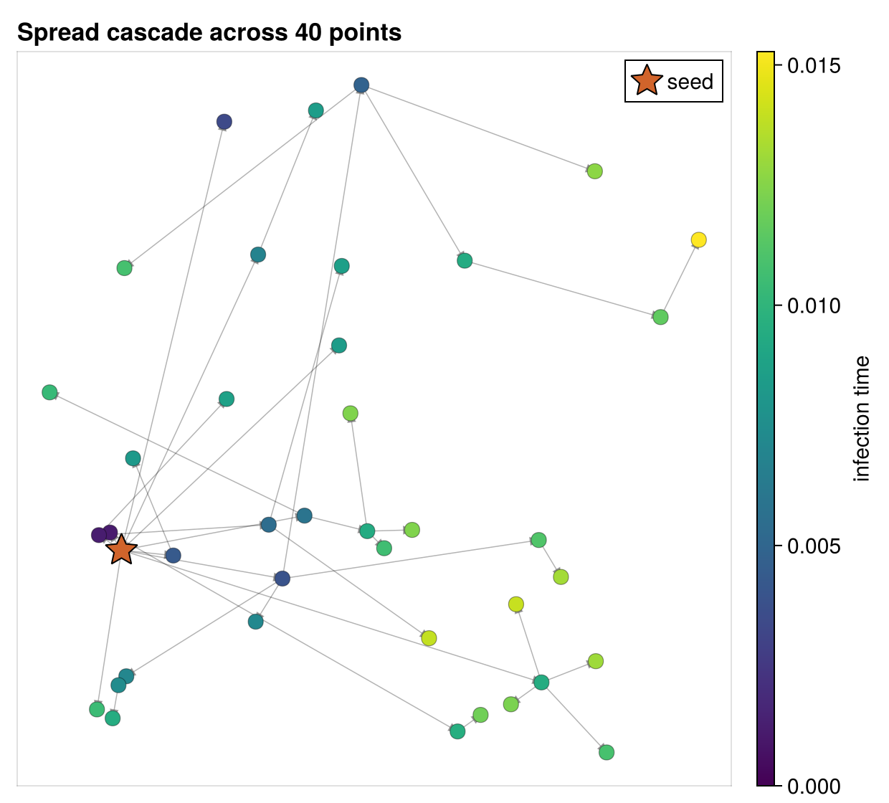

# The Landspread Model

Landspread simulates a contagion spreading across a landscape: a set of points
scattered on a plane, where an occupied point can spread to an unoccupied one at
a rate that depends on the distance between them. It is the repository's
canonical demonstration of the **θ (parameter) seam** — the four-argument form of
`enable` that lets one recorded trajectory be re-scored at different parameter
values.



*The signature figure: points placed on the unit square, colored by the time
each was infected, with an arrow from source to destination for every spread.
The star marks the seed (point 1), and the cascade fans out from it.*

## Where it comes from

The header describes the process directly:

> This will simulate spread across a landscape as a process on a graph. There are
> points on a 2D plane and distances among those points. The rate of spread from
> one point to the next depends on the distance. You start it somewhere and
> observe it later.

The intellectual inspiration is disease spread across geographic sites. The
companion file `src/landspread/genspread.jl` frames the problem as inferring
infection events from partial observations, and the repository carries a
reference PDF, `rjmcmc_chagas.pdf`, on reversible-jump MCMC for Chagas disease.

!!! note "genspread.jl is a sketch, not a runnable example"
    `genspread.jl` is a standalone RJMCMC prototype written against the `Gen`
    probabilistic-programming library. It is **not** part of the compiled module
    (`ChronoSimExamples.jl` does not `include` it) and it references a
    `landspread_log_likelihood` function that does not exist — the real one is
    `landspread_likelihood`. Read it as an illustration of how the θ-seam
    likelihood *would* feed a Bayesian inference layer, not as working code.

## What it models

`N` points are placed at random on the unit square. A binary occupation state
spreads from point to point: an occupied point ("mark = 1") can infect an
unoccupied one ("mark = 0"), and the waiting time for that spread depends on the
Euclidean distance between them. The landscape is fully connected — every point
can in principle spread to every other — with distance only modulating the
timing. The process is **monotone**: a point never becomes unoccupied again, so a
run seeded at one point eventually saturates the whole landscape.

## State

Landspread is unusual among these examples in that it does **not** use the
`@observedphysical` macro. Instead it tracks reads and writes by hand with
`@obsread` and `@obswrite`, which is why the state carries its own observation
sets:

```julia
struct Landscape <: ObservedPhysical
    mark::Array{Int,1}            # 0 = unoccupied, 1 = occupied
    distance::Array{Float64,2}    # N×N Euclidean distance matrix
    obs_read::Set{Tuple}          # addresses read this step
    obs_modified::Set{Tuple}      # addresses written this step
end
```

The constructor `Landscape(N, rng)` draws `N` random locations on the plane,
fills the distance matrix, and starts every point unoccupied.

## The single event

There is one event type, `Spread`, with a source and a destination:

```julia
struct Spread <: SimEvent
    source::Int
    destination::Int
end
```

Its generator reacts to a change in any point's mark: when point `i` becomes
occupied, it proposes `Spread(i, j)` for every other point `j`. Its precondition
admits the event only when the source is occupied and the destination is empty:

```julia
@guard function precondition(evt::Spread, land)
    source_mark = @obsread land.mark[evt.source]
    dest_mark = @obsread land.mark[evt.destination]
    return evt.source != evt.destination && source_mark == 1 && dest_mark == 0
end
```

Firing marks the destination occupied — written as two statements, a plain
assignment followed by `@obswrite` applied only to the *access*:

```julia
@fire function fire!(evt::Spread, land, when, rng)
    land.mark[evt.destination] = 1
    @obswrite land.mark[evt.destination]
end
```

!!! warning "A historical bug worth understanding"
    Writing this as `@obswrite land.mark[evt.destination] = 1` would drop the
    right-hand side: the macro records the address but evaluates only the access,
    so the write never happens. That exact mistake once made landspread run zero
    events while appearing to run fine. The [usage page](usage.md) shows the test
    that now guards against it.

The initializer seeds point 1 (`mark[1] = 1`), which produces the first
`changed(mark[1])` and bootstraps the whole cascade.

## The θ seam

The reason landspread exists is its `enable`, which takes the four-argument form
and reads its coefficients from the parameter vector `θ` rather than hard-coding
them:

```julia
const SPREAD_THETA = [0.1, 1.2]

function enable(evt::Spread, land, θ, when)
    dist = land.distance[evt.source, evt.destination]
    scale = θ[1] * dist^θ[2]
    return (Weibull(2, scale), when)
end
```

Here `θ[1]` is the scale coefficient and `θ[2]` the distance exponent of the
Weibull spread clock; a larger distance yields a larger scale and therefore
slower spread. The header explains why this matters:

> Reading the spread coefficients from θ instead of hard-coding them means an
> estimator can re-evaluate this same trace at a different θ — including a vector
> of ForwardDiff duals — through the `params=` keyword of `trace_likelihood`,
> with no module-global state.

The parameter vector enters the simulation through the `params=` keyword of the
`SimulationFSM` constructor (for generating a trajectory) and the `params=`
keyword of `trace_likelihood` (for scoring one). Because nothing lives in
module-global state, the same recorded trajectory can be scored at any θ — the
property that makes gradient-based model fitting possible. Models that still use
the three-argument `enable` keep working; the four-argument default forwards to
them, as the [reliability model](../reliability/model.md) deliberately shows.
