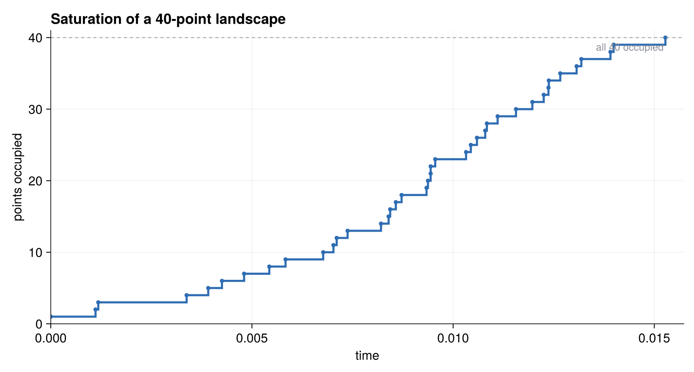
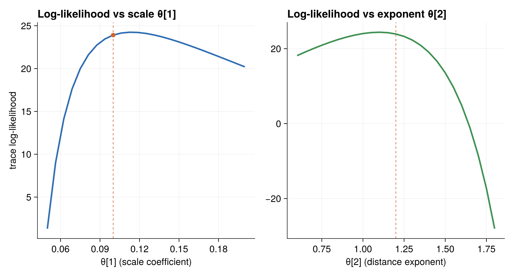

# Running the Landspread Model

Landspread has two entry points: one that generates a trajectory, and one that
scores a trajectory's log-likelihood at a chosen θ. Together they demonstrate the
whole point of the θ seam — generate once, score at many parameter values.

## Generating a trajectory

`run_landspread(point_cnt; θ=SPREAD_THETA)` builds a landscape, runs the spread
to saturation, and returns the recorded trajectory:

```julia
function run_landspread(point_cnt; θ=SPREAD_THETA)
    rng = Xoshiro(9437294723)
    land = Landscape(point_cnt, rng)
    trajectory = TrajectorySave()
    sim = SimulationFSM(land, [Spread]; rng=rng, observer=trajectory, params=θ)
    stop_condition = (land, step, event, when) -> false   # run until no events remain
    ChronoSim.run(sim, init_physical!, stop_condition)
    return trajectory.trajectory
end
```

The stop condition always returns `false`; because the process is monotone, the
simulation ends on its own when every point is occupied and no `Spread` event can
be proposed. Note how `θ` is handed to the simulation through the `params=`
keyword.

```julia
using ChronoSimExamples.LandSpread
traj = LandSpread.run_landspread(10)
```



*Cumulative occupied points versus time for a single 40-point run. Because the
process is monotone, the step curve only climbs, and it stops the moment the
last point is occupied.*

## Scoring a trajectory at a parameter value

`landspread_likelihood(point_cnt; θ=SPREAD_THETA)` records a trajectory and then
evaluates its trace log-likelihood at `θ`:

```julia
function landspread_likelihood(point_cnt; θ=SPREAD_THETA)
    trajectory = run_landspread(point_cnt)          # generated at SPREAD_THETA
    # ... convert to an event vector, drop the initialize event ...
    rng = Xoshiro(9437294723)
    land = Landscape(point_cnt, rng)
    sim = SimulationFSM(land, [Spread];
        sampler=NextReactionMethod(), key_type=Tuple,
        step_likelihood=true, likelihood_eltype=eltype(θ), rng=rng)
    return ChronoSim.trace_likelihood(sim, init_physical!, event_vector; params=θ).loglikelihood
end
```

Two details make the θ seam work here:

- The trajectory is generated at the default `SPREAD_THETA`, but the *scoring*
  uses whatever `θ` you pass. That is exactly the "score the same trace at a
  different θ" capability.
- `likelihood_eltype=eltype(θ)` lets the accumulator hold whatever element type
  `θ` has — so a vector of `ForwardDiff.Dual` numbers flows through, and the
  gradient of the log-likelihood in the parameters comes out.

```julia
LandSpread.landspread_likelihood(10)                 # score at SPREAD_THETA
LandSpread.landspread_likelihood(10; θ=[0.2, 1.0])   # score the same trace elsewhere
```



*Scoring one recorded trace at a grid of parameter values. Sweeping either the
scale coefficient θ[1] or the distance exponent θ[2] traces a smooth
log-likelihood curve; the dashed line marks the generating `SPREAD_THETA`. This
is the θ seam in one picture — generate once, score at many θ.*

## The tests

The tests in `test/test_landspread.jl` are short but pointed. Their header
records why they exist:

> Landspread previously had no functional test, which is how a silent no-write
> bug ... left it running zero events without anyone noticing. These tests pin
> that the process actually spreads and that the θ seam evaluates the same trace
> at different parameters.

The first test pins the saturation behavior. A ten-point run must produce exactly
ten trajectory entries — one initialize event plus nine spreads, since every
non-seed point gets occupied exactly once:

```julia
traj = with_logger(ConsoleLogger(stderr, Logging.Warn)) do
    LandSpread.run_landspread(10)
end
@test length(traj) == 10
@test count(te -> te.event[1] == :Spread, traj) == 9
```

The second test pins the θ seam. It scores the same recorded trace at two
different parameter vectors and asserts both are finite and that they differ —
the defining property that an estimator relies on:

```julia
ll, ll_shifted = with_logger(ConsoleLogger(stderr, Logging.Warn)) do
    (LandSpread.landspread_likelihood(10),
     LandSpread.landspread_likelihood(10; θ=[0.2, 1.0]))
end
@test isfinite(ll)
@test isfinite(ll_shifted)
@test ll != ll_shifted
```

These two tests are the whole story for landspread: the process spreads and
saturates, and its likelihood moves with θ. For a fuller record-and-differentiate
workflow — including checking a gradient against a hand-derived analytic score —
see the [repair shop](../repairshop/model.md).
