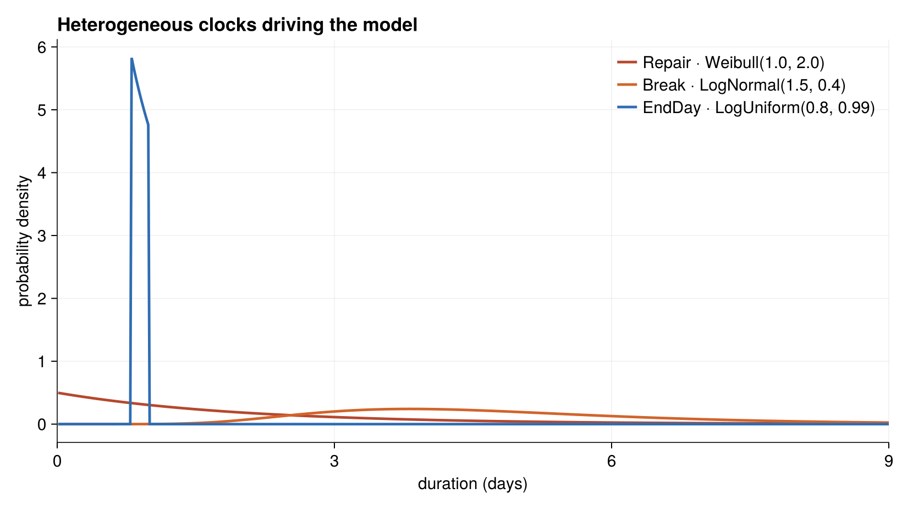
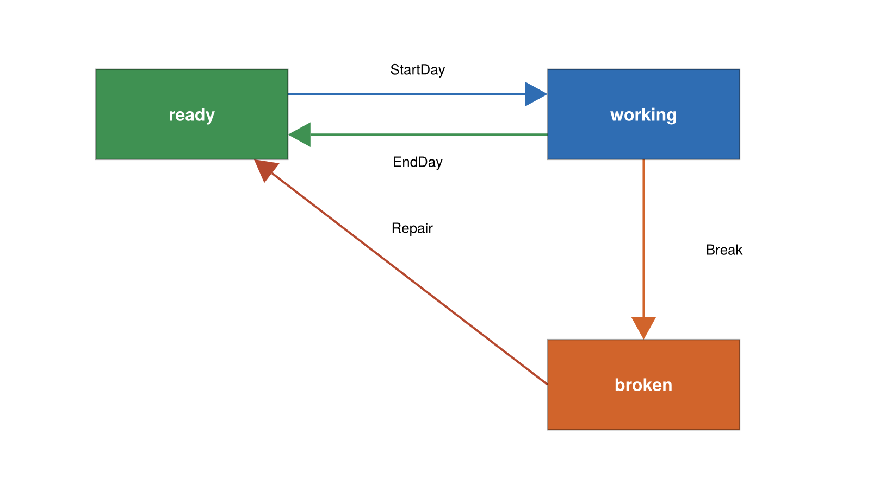

# The Reliability Model

The reliability example simulates a fleet of machines — think of a yard of
trucks — that go out to work each day and, as they accumulate hours, break down
and get repaired. It is a compact model whose real job in this repository is to
demonstrate that ChronoSim's older three-argument `enable` signature still works
unchanged.

## Where it comes from

There is no external citation. The model is a purpose-built example. Its
vocabulary is generic — the code speaks of `actors`, `workers`, and a `crew`
rather than trucks specifically — so read "machine" for any unit that works,
ages, and fails.

## What it models

A fixed fleet of 15 machines. Each day a crew of up to 10 of them is put to work
at a fixed start time (8:00, with time measured in days). While a machine is
working it can either finish its day or break down. The chance of breaking down
rises with the machine's *accumulated work age* — the total time it has ever
spent working — so machines that have logged more hours fail sooner. A broken
machine is repaired, which returns it to service and resets its age to zero, as
though it were made new.

## State

Each machine is a keyed record:

```julia
@enum Activity ready working broken

@keyedby Individual Int64 begin
    state::Activity                 # ready, working, or broken
    work_age::Float64               # cumulative time ever spent working
    started_working_time::Float64   # sim time the current stint began
end
```

Each machine also carries an immutable bundle of the distributions that govern
its timing:

```julia
struct IndividualParams
    done_dist::LogUniform    # time to finish the workday
    fail_dist::LogNormal     # time to failure
    repair_dist::Weibull     # repair duration
end
```

The whole fleet is the observed physical state:

```julia
@observedphysical IndividualState begin
    actors::ObservedVector{Individual,Member}
    params::Vector{IndividualParams}
    workers_max::Int          # daily crew-size cap
    start_time::Float64       # time of day the workday starts (8/24)
end
```

The constructor `IndividualState(actor_cnt, crew_size)` builds every machine as
`Individual(ready, 0.0, 0.0)` and gives them one shared parameter set:
`LogUniform(0.8, 0.99)` for finishing the day, `LogNormal(1.5, 0.4)` for
failure, and `Weibull(1.0, 2.0)` for repair.



*The three clocks live on very different timescales: the end-of-day
`LogUniform` is a narrow spike just under one day, while failure and repair
spread across several days.*

## Events

Four events drive the model. `StartDay` has no argument; the others carry a
machine index.



*A single machine cycles through three states; each arrow is the event that
drives the transition.*

**`StartDay`** — always enabled, it fires once per day at the workday start. Its
`enable` computes a deterministic delay to the next 8:00 boundary and returns a
`Dirac` clock, so the workday begins at the same time every day. When it fires,
it walks the fleet and sets `ready` machines to `working` (recording their start
time) until the crew cap is reached.

**`EndDay(machine)`** — enabled while a machine is `working`. Its clock is the
machine's `done_dist` (`LogUniform`). Firing returns the machine to `ready` and
adds the elapsed stint to its `work_age`.

**`Break(machine)`** — enabled while a machine is `working`. This is where the
aging model lives. Rather than starting the failure clock at the current stint,
its `enable` offsets the clock's start *backward* by the accumulated work age:

```julia
function enable(evt::Break, physical, when)
    started_ago = when - physical.actors[evt.actor_idx].work_age
    return (physical.params[evt.actor_idx].fail_dist, started_ago)
end
```

so the failure hazard is a function of total work age, not of the current day.
Firing sets the machine `broken` and folds the stint into `work_age`.

**`Repair(machine)`** — enabled while a machine is `broken`. Its clock is the
`repair_dist` (`Weibull`). Firing returns the machine to `ready` and resets
`work_age = 0.0`, restoring it to as-new condition.

A warm-start `initialize!` gives each machine a random initial `work_age` drawn
from `Uniform(0, 10)`, so the fleet does not all age in lockstep.

## The three-argument `enable`, on purpose

Notice that the `enable` methods above take three arguments —
`enable(event, physical, when)` — not the four-argument form
`enable(event, physical, θ, when)` that the [landspread](../landspread/model.md)
model uses. This is deliberate. The header comment explains:

> This module DELIBERATELY keeps the pre-θ-seam three-argument `enable`
> signature. ChronoSim's engine now calls the four-argument θ-seam form, and its
> default method forwards to this one, so a model that reads no parameters from θ
> needs no change. This module (and its `ReliabilityDerivedSim` twin) is the
> suite's standing evidence that the fallback works.

In other words, the engine always calls the four-argument form internally; a
default method forwards it to a three-argument method. A model that reads nothing
from the parameter vector never has to be touched. Reliability exists to prove
that backward-compatibility path keeps working.

## The derived twin

As with the other paired models, `ReliabilityDerivedSim`
(`src/reliability/reliability_derived.jl`) is a copy whose triggers are derived
from the preconditions. The physical state, events, and timing are identical; the
only difference is that `EndDay`, `Break`, and `Repair` declare a `@precondition`
and let ChronoSim derive their triggers, instead of writing `@conditionsfor`
blocks by hand. `StartDay` stays hand-written in *both* twins, because its
precondition is `true` — it reads no state, so there is nothing to derive from.

Because both twins key their clocks by `nameof(type)`, their trajectories can be
compared directly; that comparison is what `test/test_differential.jl` and
`test/test_overapprox.jl` check. See [Running the Reliability Model](usage.md).
