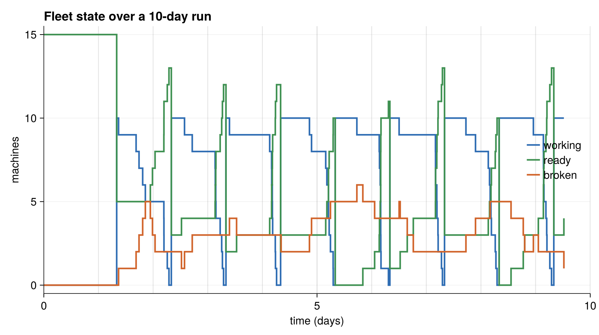

# Running the Reliability Model

## The entry point

The hand-written model exposes `run_reliability(days)`, which builds a
15-machine fleet with a crew cap of 10 and runs it for the requested number of
days:

```julia
function run_reliability(days)
    physical = IndividualState(15, 10)
    included_transitions = [StartDay, EndDay, Break, Repair]
    trajectory = TrajectorySave()
    sim = SimulationFSM(
        physical, included_transitions;
        rng=Xoshiro(2947223), observer=trajectory,
        sampler=NextReactionMethod(), key_type=Tuple)
    initializer = (physical, when, rng) -> initialize!(physical, rng)
    stop_condition = (physical, step_idx, event, when) -> when > days
    ChronoSim.run(sim, initializer, stop_condition)
    return sim.when
end
```

The `stop_condition` sees each chosen event before it fires, so the run stops
cleanly at the requested day boundary rather than partway through an event.

To run it:

```julia
using ChronoSimExamples.ReliabilitySim
ReliabilitySim.run_reliability(10.0)   # ten simulated days
```



*Reconstructing the run with a state-counting observer shows the daily rhythm:
each morning `StartDay` lifts the working count to the crew cap of 10, machines
trickle back to `ready` as they finish, and a growing tail sits `broken`
awaiting repair.*

The derived twin has a matching entry point, `run_reliability_derived(days)`,
which is identical except that it attaches no observer.

## The tests

The dedicated tests in `test/test_reliability.jl` are intentionally minimal —
two smoke checks with no assertions on the numbers produced.

The first confirms the state constructs:

```julia
@testset "Reliability smoke" begin
    using ChronoSimExamples.ReliabilitySim
    is = ReliabilitySim.IndividualState(15, 10)
end
```

The second runs the whole simulation end to end, adjusting the log level for CI:

```julia
@testset "Reliability run" begin
    using ChronoSimExamples.ReliabilitySim
    ci = continuous_integration()
    log_level = ci ? Logging.Error : Logging.Debug
    with_logger(ConsoleLogger(stderr, log_level)) do
        run_reliability(10)
    end
end
```

Passing without error means the fleet ran for ten days: machines went to work,
some finished their day, some broke down and were repaired, and the aging clocks
behaved. There is no assertion on trajectory contents here.

## Where the model is checked more rigorously

The substantive checking of this model does not live in `test_reliability.jl`.
It happens in the tests that compare the hand-written model against its derived
twin, which is why the two share clock keys:

- `test/test_differential.jl` runs `ReliabilitySim` and `ReliabilityDerivedSim`
  from the same seed and asserts their trajectories match step for step — the
  guarantee that hand-written and derived triggers are equivalent.
- `test/test_overapprox.jl` runs both and compares aggregate statistics, and
  measures the extra proposal cost the derived generators pay for their
  over-approximation.

If you want a worked example of the θ seam that reliability deliberately avoids,
see the [landspread model](../landspread/model.md); for the record, check, and
differentiate workflow, see the [repair shop](../repairshop/model.md).
