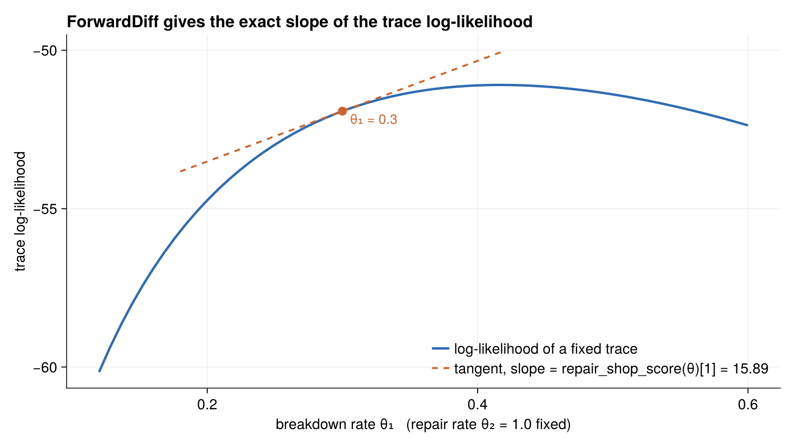

# The Likelihood Workflow

The repair shop's main job is to demonstrate a three-step pattern that
ChronoSim's record/replay machinery exists to support:

1. **Record** one run under a `RecordMinimal` policy, capturing a `MinimalRecord`.
2. **Check** the record with `effect_check` — replaying it must reproduce the
   forward log-likelihood *exactly*, `===` and not `≈`.
3. **Differentiate** the trace log-likelihood in `θ` with ForwardDiff, evaluating
   at a `θ` the forward run never saw.

The example then verifies the resulting gradient against a hand-derived analytic
score, so this is an oracle-checked demonstration rather than a demo that merely
runs.

## Recording a run

`record_repair_shop` runs the simulation once under the `RecordMinimal` policy and
returns the captured record together with the policy:

```julia
function record_repair_shop(θ; machine_cnt=3, horizon=20.0, seed=90210)
    policy = RecordMinimal(; initializer=init!)
    sim = SimulationFSM(Shop(machine_cnt), _events();
        step_likelihood=true, policy=policy, params=θ,
        sampler=NextReactionMethod(), key_type=Tuple)
    stop_condition = (shop, step, event, when) -> when > horizon
    ChronoSim.run(sim, init!, stop_condition)
    return (record=minimal_record(policy; horizon=horizon), policy=policy)
end
```

A `MinimalRecord` holds just enough to replay: the initializer, the ordered
sequence of `(clock key, firing time)` pairs, the horizon, and a `fire_random`
flag recording whether any `fire!` body drew randomness. For the repair shop that
flag is `false`, which is why replay is deterministic.

## Checking the record exactly

`effect_check` replays the record through `trace_likelihood` and demands exact
floating-point equality with the forward log-likelihood. Because forward execution
and trace evaluation share one code path, any difference is a bug, not roundoff —
so the check is `===`, not `≈`:

```julia
factory = () -> SimulationFSM(Shop(machine_cnt), RepairShop._events();
    step_likelihood=true, params=θ,
    sampler=NextReactionMethod(), key_type=Tuple)
res = ChronoSim.effect_check(factory, RepairShop.init!, policy)

@test res.applicable
@test res.passed
@test res.forward === res.replay   # exact Float64 identity, not isapprox
@test isfinite(res.forward)
```

## Differentiating the trace log-likelihood

Scoring is done by rebuilding a fresh evaluation simulation and calling
`trace_likelihood` with the record and a chosen `θ`. The
`likelihood_eltype=eltype(θ)` keyword lets dual numbers accumulate without being
truncated to `Float64`, and `censor=true` adds the finite-horizon survival tail:

```julia
function repair_shop_loglik(θ, record; machine_cnt=3)
    sim = SimulationFSM(Shop(machine_cnt), _events();
        step_likelihood=true, params=θ, likelihood_eltype=eltype(θ),
        sampler=NextReactionMethod(), key_type=Tuple)
    return trace_likelihood(sim, init!, record; params=θ, censor=true).loglikelihood
end

repair_shop_score(θ, record; machine_cnt=3) =
    ForwardDiff.gradient(p -> repair_shop_loglik(p, record; machine_cnt), θ)
```



*One record from `record_repair_shop([0.3, 1.0])` is fixed; sweeping the breakdown rate θ₁ traces the trace log-likelihood, and the dashed line is the tangent whose slope is `repair_shop_score(θ)[1]` — ForwardDiff recovers the exact slope of the curve.*

The trace is *fixed*; only the evaluation parameters vary. That makes the score a
deterministic function of `(θ, record)` — the same property landspread
demonstrates, applied here to a differentiable gradient.

The whole workflow is wrapped up in `repair_shop_demo`, which records, checks, and
scores, printing the firing count, the log-likelihood, and the score.

## The analytic oracle

Because both clocks are exponential, the trace log-likelihood has a closed form.
With `n_break` breakdowns, `n_repair` repairs, and exposures `E_run` (total
machine-time spent running) and `E_down` (spent down):

```
loglik = n_break·log(λ_b) + n_repair·log(λ_r) − λ_b·E_run − λ_r·E_down
```

which differentiates to

```
dloglik/dλ_b = n_break/λ_b − E_run
dloglik/dλ_r = n_repair/λ_r − E_down
```

The test in `test/test_repairshop.jl` implements exactly this in
`analytic_score`, walking the record's firings to accumulate the exposures and
counts and adding the censoring tail from the last firing to the horizon.

## The tests

`test/test_repairshop.jl` is thorough — three testsets built on the hand-derived
oracle.

The first pins that the recorded trajectory is usable and reproducible: it draws
no randomness, has the expected horizon, is long enough to be worth testing, and
comes out identical from the same seed:

```julia
(; record, policy) = RepairShop.record_repair_shop(θ; machine_cnt=3, horizon=20.0, seed=90210)
@test record.fire_random == false
@test record.horizon == 20.0
@test length(record.firings) > 10
again = RepairShop.record_repair_shop(θ; machine_cnt=3, horizon=20.0, seed=90210)
@test again.record.firings == record.firings
```

The second is the `effect_check` example shown above — replay reproduces the
forward log-likelihood to exact `Float64` identity.

The third checks the ForwardDiff score against the analytic oracle, and then
re-scores the *same fixed trace* at a different `θ` and checks that too — showing
the score is correct away from the parameters that generated the trace, which is
the property estimators rely on:

```julia
g = RepairShop.repair_shop_score(θ, record; machine_cnt)
@test isapprox(g, analytic_score(θ, record, machine_cnt); rtol=1e-9)

θ2 = [0.5, 0.7]
g2 = RepairShop.repair_shop_score(θ2, record; machine_cnt)
@test isapprox(g2, analytic_score(θ2, record, machine_cnt); rtol=1e-9)
```

Note the tolerance: `rtol=1e-9`. The ForwardDiff gradient and the hand-derived
formula agree to nine digits, because they are computing the same thing two ways.

The [gradient estimators](gradients.md) page covers the companion example, which
moves from differentiating a *fixed trace* to estimating the gradient of an
*expectation* over trajectories.
