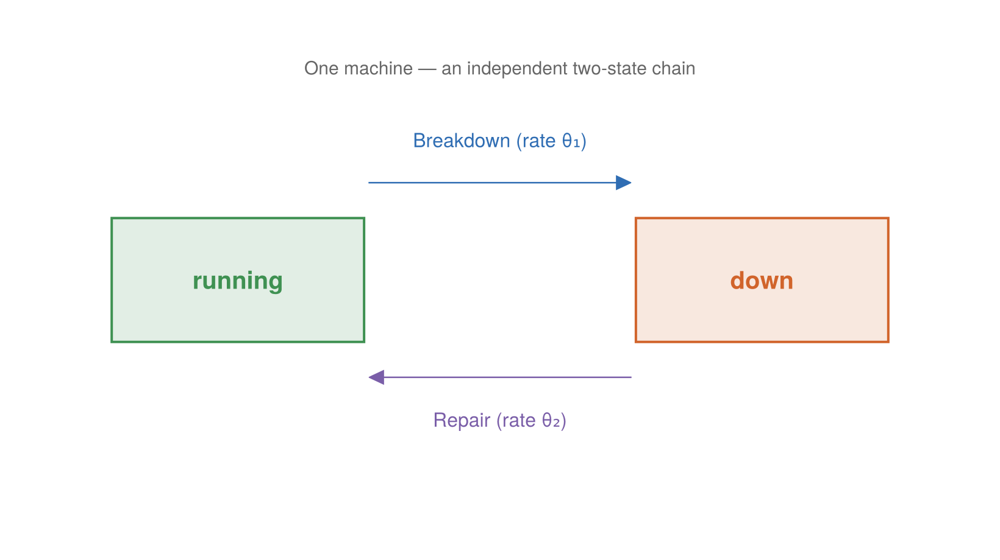

# The Repair Shop Model

The repair shop is a deliberately tiny model — a handful of machines that break
down and get repaired — whose purpose is not the dynamics but the *machinery
around* the dynamics. It is the repository's demonstration of ChronoSim's
record-and-replay workflow and of differentiating a trajectory's likelihood with
respect to its parameters.

## Where it comes from

There is no external citation; it is a purpose-built demonstration vehicle. The
header states the intent plainly:

> The model: `machine_cnt` machines run until they break down and are repaired.
> Both clocks are exponential; θ = [breakdown rate, repair rate]. Exponential
> clocks keep the analytic score simple enough to verify by hand in the test
> suite, which is what makes this example an oracle-checked demonstration rather
> than a demo that merely runs.

Structurally it is the classic queueing-theory "machine repair problem," though
the code never uses that name — and, importantly, there is no limited repairman
resource. Every down machine is repaired concurrently, so the model is really
`machine_cnt` independent two-state Markov chains: each machine goes up →(λ) down
→(μ) up. That independence is exactly what makes a closed-form answer available to
check the estimators against.

## What it models

A shop of `machine_cnt` machines (default 3). Each machine is either `running` or
`down`. A running machine breaks down after an `Exponential(θ[1])` delay; a down
machine is repaired after an `Exponential(θ[2])` delay and returns to running.
The parameter vector is `θ = [breakdown rate, repair rate]`.

## State

The state is minimal — one condition field per machine:

```julia
@enum MachineCondition running down

@keyedby Machine Int64 begin
    condition::MachineCondition
end

@observedphysical Shop begin
    machines::ObservedVector{Machine,Member}
end
```

`Shop(machine_cnt)` allocates the machines and starts each one `running`.

## Events

Two events, each keyed by a machine index. Both take the four-argument θ-seam
form of `enable`, building their exponential clock from the caller-supplied `θ`:



*Each machine is an independent two-state chain: `running` breaks down at rate θ₁ and `down` is repaired at rate θ₂.*

**`Breakdown(machine)`** — enabled while the machine is `running`:

```julia
enable(evt::Breakdown, shop, θ, when) = (Exponential(inv(θ[1])), when)

function fire!(evt::Breakdown, shop, when, rng)
    shop.machines[evt.machine].condition = down
end
```

**`Repair(machine)`** — enabled while the machine is `down`:

```julia
enable(evt::Repair, shop, θ, when) = (Exponential(inv(θ[2])), when)

function fire!(evt::Repair, shop, when, rng)
    shop.machines[evt.machine].condition = running
end
```

Neither `fire!` draws any randomness — the events only flip a condition. That
matters for the record-and-replay workflow: because nothing in a firing consumes
the random stream, a recorded trajectory replays deterministically. The
initializer writes every machine's condition to `running`, and those writes
propose the first `Breakdown` events.

## Why θ is read from a parameter vector

The load-bearing design point is that each event builds its distribution from the
`θ` passed in, not from a constant baked into the code. When `θ` is an ordinary
vector of floats you get an ordinary simulation. When `θ` is a vector of
`ForwardDiff.Dual` numbers, `inv(θ[1])` promotes and the dual flows into the
`Exponential` — so evaluating the trajectory's likelihood at a dual-valued `θ`
yields not just the log-likelihood but its gradient in the parameters, with no
global state changing between evaluations. That is the foundation of the two
pages that follow:

- [The likelihood workflow](likelihood.md) — record a run, check the replay
  against the forward log-likelihood exactly, then differentiate the trace
  log-likelihood with ForwardDiff and compare to a hand-derived analytic score.
- [Gradient estimators](gradients.md) — the companion `repairshop_gradients.jl`
  runs ClockGradients' whole estimator family against one closed-form oracle.
