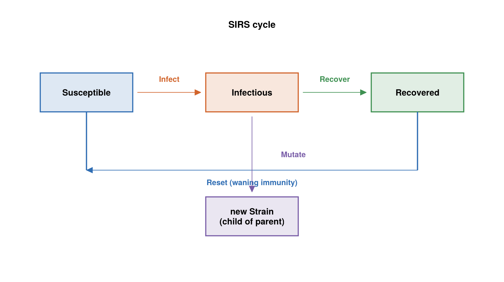
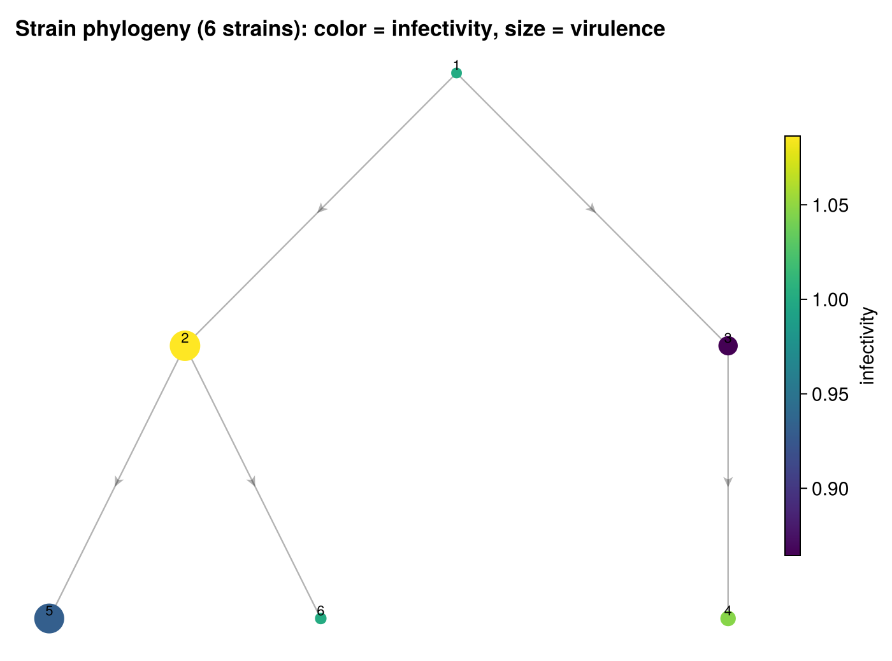

# The SIR Village Model

SIR Village is an individual-based epidemic simulation with a twist: the pathogen
itself evolves. People move around a village, catch and recover from disease at
rates that differ from person to person, and the disease mutates into new strains
that escape prior immunity. It is the largest and most feature-rich model in the
repository.

## Where it comes from

There is no cited paper; the origin is a design narrative in the module
docstring. The author's stated goal:

> The goal is to make a disease simulation that's a little bit fun. You may have
> seen disease simulations that show susceptible-infectious-recovered (SIR)
> transitions for individuals. That's easy to do without any framework, so let's
> make a halfway realistic simulation...

Four design choices give the model its character:

1. **Gamma recovery.** Recovery time is Gamma-distributed — "the classic rate use
   in disease studies, not Exponential."
2. **Heterogeneous susceptibility.** Each person has a different robustness;
   "epidemiologists have long understood this is crucial for understanding
   disease spread."
3. **Localized contact through movement.** People "move around a city, or let's
   say a village, so that they have localized sets of contacts. Each person
   follows a semi-Markovian walk around a subset of locations." That movement
   model is derived in [Characterizing Travel](../../dwell.md).
4. **An evolving pathogen.** Credited to a colleague who "railed at me for not
   including evolution in SIR simulations" — the disease mutates into strains with
   different infectivity and virulence, and "every new strain escapes the previous
   one, so it can reinfect a person."

## What it models

An agent-based **SIRS** epidemic with pathogen evolution, set in a village.
Individuals move among discrete locations; disease transmits only between people
who share a location. The three disease states are Susceptible, Infectious, and
Recovered — and because a `Reset` event returns recovered people to susceptible,
immunity wanes and the model is SIRS rather than plain SIR. There is no latent
compartment, so it is not SEIR.



*The three disease states and the events that move a person between them; `Mutate`
acts within Infectious, giving birth to a child strain.*

Every individual is tracked separately with its own parameters: a robustness draw
that governs susceptibility and recovery speed, a personal subset of locations it
visits, and personal dwell and exit parameters. The pathogen is a growing set of
strains, each with an infectivity and a virulence, that are born inside infectious
people and can reinfect those who recovered from an ancestor strain.

## State

Individuals carry their disease state, current strain, and current location:

```julia
@enum DiseaseState Susceptible Infectious Recovered

@keyedby Individual Int64 begin
    state::DiseaseState
    strain::Int64      # infecting strain id; 0 if none
    haunt::Int64       # index into this person's haunts, not a global location id
end
```

Per-person configuration is an immutable struct, never mutated after
construction:

```julia
struct IndividualParams
    robustness::Float64
    haunts::Vector{Int64}       # global location ids this person visits
    exit_sum::Vector{Float64}   # per-haunt Weibull rate constant (dwell time)
    exit_frac::Vector{Float64}  # per-haunt destination probability
end
```

Locations track who is present, and strains form a small phylogeny:

```julia
@keyedby Location Int64 begin
    individual_cnt::Int64
    individuals::Vector{Int64}   # roster of ids currently here
end

@keyedby Strain Int64 begin
    infectivity::Float64   # scales infection rate
    virulence::Float64     # scales recovery time
    parent::Int64          # parent strain id; 0 for the founding strain
end
```

The whole village is the observed physical state:

```julia
@observedphysical Village begin
    actors::ObservedVector{Individual,Member}
    actor_params::Param{Vector{IndividualParams}}   # immutable config, unobserved
    locations::ObservedVector{Location,Member}
    strains::ObservedDict{Int64,Strain,Member}
    next_strain_id::Int64
end
```

Two modeling decisions here are worth calling out, because they were driven by
the framework:

- **`strains` is an `ObservedDict`, not an `ObservedVector`.** Strains are born
  at runtime, and a fixed-extent vector throws `FixedExtentError` on `push!`. A
  keyed dict grows safely; `next_strain_id` hands out fresh ids without reading
  the dict's length inside an event body. (Before this change, any run long
  enough to mutate would crash — see the [usage page](usage.md).)
- **`actor_params` is wrapped in `Param{...}`** to mark it unobservable. As a
  plain vector, reads of it would emit whole-field read notifications that the
  derivation coverage oracle would flag.

## Events

Six event types drive the simulation, plus a bootstrap `InitEvent`.

**`Travel(who)`** — always enabled; a rate-driven walk. Its clock is
`Weibull(2, scale)` with `scale = 2 / exit_sum[haunt]`, the linearly-rising
hazard from the movement model. Firing chooses a destination haunt from a
`Categorical` over `exit_frac`, updates the source and destination location
rosters, and sets the new haunt.

**`Infect(source, sink)`** — enabled when the source is Infectious, the sink is
Susceptible, and both are at the same location. Its clock is
`Exponential(inv(infectivity / robustness))`, so a more robust sink or a less
infective strain means a longer wait. Firing copies the source's strain to the
sink and makes it Infectious.

**`Recover(who)`** — enabled while a person is Infectious. Its clock is the
classic `Gamma(3, inv(robustness / virulence))`; a more virulent strain lengthens
recovery. Firing moves the person to Recovered.

**`Reset(who)`** — enabled while a person is Recovered. Its clock is
`Exponential(inv(0.05))` (mean 20 time units). Firing returns the person to
Susceptible with strain 0 — this is the "S" that makes the model SIRS.

**`Mutate(carrier)`** — enabled while a person is Infectious; "mutation happens
within the sick person." Its clock is `Exponential(inv(0.01))`. Firing draws a
child strain's infectivity and virulence from a bivariate lognormal centered on
the parent's values, creates a new `Strain` with `parent` set to the current
strain, assigns it `next_strain_id`, and switches the carrier to the new child.
This is the runtime "birth" that requires the dict-keyed `strains`.



*The `parent` field of each `Strain` forms a tree rooted at the founding strain
(id 1). Node color is infectivity, node size is virulence; both drift from the
parent's values through the bivariate-lognormal mutation kernel.*

**`InitEvent()`** — the bootstrap. It places each actor at a random haunt, infects
the first ten percent of the population with the founding strain, and seeds a few
extra strains by directly firing `Mutate` a handful of times.

## Invariants

The model declares `@invariant` blocks that a `CheckInvariants` policy verifies
after every event: there is always at least one strain, strain rates are
nonnegative, every strain's parent id is valid, each location's count matches its
roster, and every sick actor carries a strain. The [usage page](usage.md) shows
how to run with these checks enabled.

## The derived twin

`SIRVillageDerived` (`src/sirvillage/sirvillage_derived.jl`) is the derived-generator
twin. The physical state, events, and timing are identical; the difference is that
`Infect`, `Recover`, `Reset`, and `Mutate` have their hand-written trigger blocks
deleted and let ChronoSim derive triggers from the precondition. `Travel` stays
hand-written in both twins, because its precondition is `true` and reads no state.

`Infect` is the headline case. Its precondition reads
`actors[source].state/.haunt` and `actors[sink].state/.haunt`, so a single change
to one person's state fires two derived generators — that person as a source with
every possible sink, and as a sink with every possible source — proposing on the
order of N candidate infections per change. The precondition's
`source_loc == sink_loc` clause then filters those over-proposals back to exactly
the co-located pairs the hand-written generator would have produced. This
over-approximate-then-filter behavior is measured in `test/test_overapprox.jl`.
