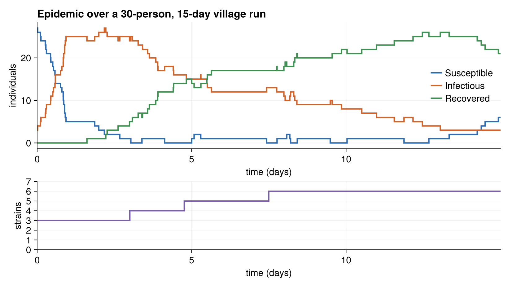

# Running the SIR Village Model

## The entry point

The hand-written model exposes `run_sirvillage`, which builds a small village
and runs it:

```julia
function run_sirvillage(; policy=ChronoSim.NoPolicy())
    person_cnt, location_cnt = 10, 10
    day_length, days = 1.0, 1.0
    rng = Xoshiro(2938423)
    physical = Village(person_cnt, location_cnt, day_length, rng)
    included_transitions = [InitEvent, Travel, Infect, Recover, Reset, Mutate]
    trajectory = TrajectorySave()
    sim = SimulationFSM(physical, included_transitions;
        rng=rng, observer=trajectory, policy=policy)
    stop_condition = (physical, step_idx, event, when) -> when > days
    ChronoSim.run(sim, InitEvent(), stop_condition)
    return sim.when
end
```

Two things distinguish this from the simpler models. First, the initializer is an
actual event — `InitEvent()` is passed to `ChronoSim.run` in place of an
initializer function, and it seeds the infection and the founding strains when it
fires. Second, `Mutate` and `Reset` make the state grow and cycle at runtime, so
a run exercises the dict-keyed strain set and the SIRS loop.

```julia
using ChronoSimExamples.SIRVillage
SIRVillage.run_sirvillage()
```

Running the larger 30-person, 15-day village from the test and counting S/I/R
states after every event gives the epidemic curve below. The infection sweeps the
village in the first day, recovery builds up an immune pool, and waning (`Reset`)
plus new strains keep infections circulating; the lower panel tracks the
cumulative number of strains as `Mutate` fires.



*A 30-person, 10-location, 15-day run (`Xoshiro(2938423)`): Susceptible,
Infectious, and Recovered counts over time, with the cumulative strain count
below.*

The derived twin has a matching `run_sirvillage_derived()` entry point (30 people,
10 locations, 30 days), with no observer or policy attached.

## Checking invariants while you run

As with the elevator, invariant checking plugs in through the `policy` keyword.
The tests stack two policies so that a violation carries a replayable prefix:

```julia
using ChronoSim: PolicyStack, RecordSkeleton, CheckInvariants
policy = PolicyStack(RecordSkeleton(), CheckInvariants(SIRVillage))
SIRVillage.run_sirvillage(policy=policy)
```

`RecordSkeleton` is placed before `CheckInvariants` so that if an invariant fails,
the recorded skeleton lets you replay the run up to the failing step.

## The test

The test in `test/test_sirvillage.jl` is a single smoke test, but a pointed one.
Its header explains what it guards against:

> The model had no smoke test (its "unfinished" state): strains was a fixed-extent
> ObservedVector whose Mutate push! throws FixedExtentError, so any run long enough
> to mutate crashed. With strains as a keyed ObservedDict the run must complete and
> actually fire events (including Mutate, which grows the strain set).

The test builds a 30-person, 10-location village, runs it for fifteen days under
the recording-plus-invariants policy stack, and counts events with a custom
observer:

```julia
event_cnt = Ref(0)
fired = Set{Symbol}()
observer = function (physical, when, event, changed)
    event_cnt[] += 1
    push!(fired, clock_key(event)[1])
end

policy = PolicyStack(RecordSkeleton(), CheckInvariants(SIRVillage))
sim = SimulationFSM(physical, included; rng=rng, observer=observer, policy=policy)
stop_condition = (p, step_idx, event, when) -> when > days
with_logger(ConsoleLogger(stderr, Logging.Warn)) do
    ChronoSim.run(sim, SIRVillage.InitEvent(), stop_condition)
end
```

Its three assertions are the smoke signals:

```julia
@test sim.when > 0.0                    # the run advanced
@test event_cnt[] > 0                   # events actually fired
@test physical.next_strain_id > 2       # a strain was born at runtime
```

The last one is the important regression guard: `next_strain_id > 2` means a
`Mutate` grew the strain set beyond the founding strain — the exact path that used
to throw `FixedExtentError` before `strains` became an `ObservedDict`. Passing the
run under `CheckInvariants` also means every one of the model's invariants held
after each of its events.

This is a smoke and regression test, not a statistical validation of the epidemic
dynamics. It confirms the machinery runs — movement, infection, recovery, waning,
and mutation all fire, and the state stays consistent throughout.
